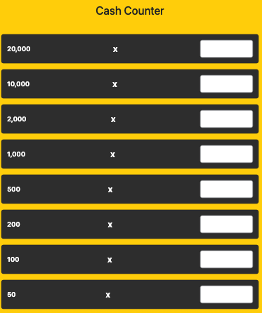
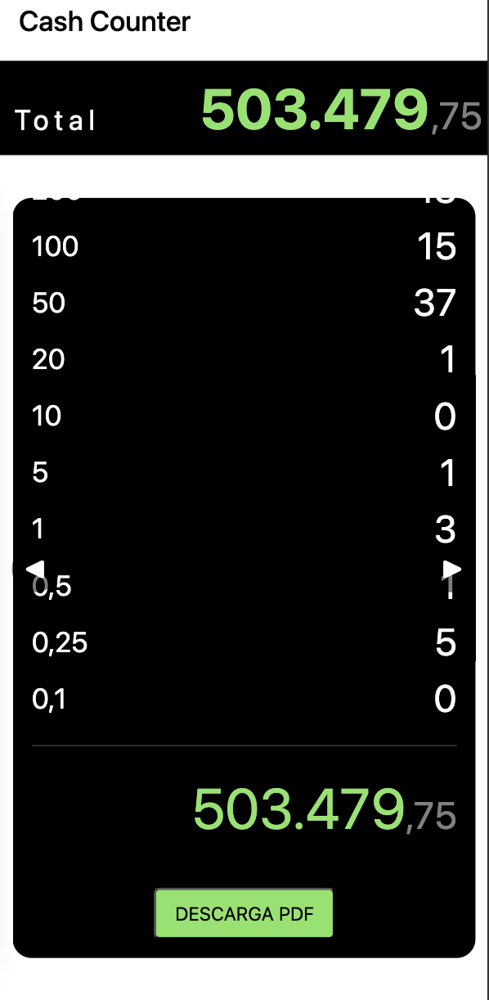

# Cash Counter 💵

<p align="center">
  <a href="https://ismaelmarot.github.io/cash-counter">
    
  </a>
</p>

Cash Counter is a web application for counting bills and calculating total cash quickly and easily. Built with **React**, **TypeScript**, and **Vite**, it can be deployed effortlessly on **GitHub Pages**.
---
[](https://opensource.org/licenses/MIT)
[](https://nodejs.org/)
[](https://reactjs.org/)
[](https://vitejs.dev/)
---

## Demo

Try the live app here:  
[https://ismaelmarot.github.io/cash-counter](https://ismaelmarot.github.io/cash-counter)

---

## Features

- Count bills by denomination.
- Automatic calculation of the total amount.
- Simple and responsive design.
- Unit tests with **Vitest**.
- Easy deployment to **GitHub Pages**.

---

## Technologies

- React + TypeScript
- Vite (bundler)
- Styled Components
- Vitest (testing)
- GitHub Pages (hosting)

---
##🛠 Tech Stack

- **React** – Frontend library for building user interfaces  
- **TypeScript** – Strongly typed JavaScript for safer code  
- **Vite** – Fast development server with Hot Module Replacement  
- **Bootstrap** – Responsive UI components  
- **jsPDF** – PDF generation for export/printing

---

##🚀 Getting Started

### Prerequisites

- Node.js >= 18.12
- npm or yarn

### Installation
```bash
git clone https://github.com/ismaelmarot/cash-counter.git
cd cash-counter
npm install
```

## Running the App
```bash
npm run dev
```
Open your browser at http://localhost:5173

---
### Project Structure
```bash
product-entry-app/
├─ src/
│  ├─ components/     # React components (forms, product list, navigation)
│  │     ├─ BillInput/
│  │     ├─ Footer/
│  │     ├─ LegalModal
│  │     ├─ TermsModal
│  │     └─ Totals
│  ├─ constants/  
│  ├─ interface/
│  ├─ helpers/        # Utility functions
│  └─ App.tsx         # Main app entry
├─ public/            # Static assets
├─ package.json
└─ vite.config.ts
```
---
### 📝 Notes

Make sure Node.js version is compatible (>=18.12)

---
### 📷 Screenshots





