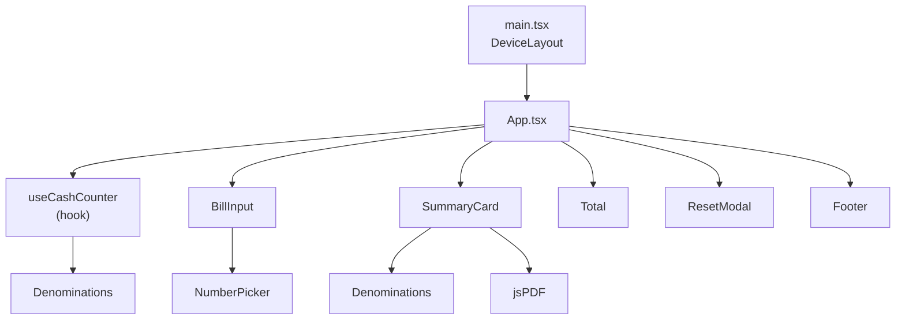

# CASH COUNTER


_Cash Counter_ is a **browser-based web application for counting physical banknotes and coins**.<br>
A user selects a denomination, enters a quantity via a custom numeric keypad, and the application computes per-denomination subtotals and a running grand total in real time. A summary can be exported as a PDF.<br>
The application is structured as a Progressive Web App (PWA), built with **React**, **TypeScript**, and **Vite**, and is deployed on GitHub Pages.


[](https://github.com/ismaelmarot/cash-counter)
&nbsp;&nbsp;&nbsp;&nbsp;
[](https://github.com/ismaelmarot/cash-counter/blob/main/LICENSE)
&nbsp;&nbsp;&nbsp;&nbsp;

[](https://github.com/ismaelmarot/cash-counter/commit/main)
&nbsp;&nbsp;&nbsp;&nbsp;

[](https://nodejs.org/)
[](https://reactjs.org/)
[](https://vitejs.dev/)


<br>

<p align="center">
  <a href="https://ismaelmarot.github.io/cash-counter/" target="_blank">
    
  </a>
</p>

<br>


------------------------------------------------------------------------------------------------------------------------------------------------


## What it Does?

  - Calculates the total amount of cash based on selected bill denominations and quantities
  - Allows users to input quantities through a custom numeric keypad modal
  - Automatically formats values using Argentine locale (es-AR) for accurate currency display
  - Dynamically updates subtotals and total amounts in real time
  - Adapts its layout to mobile, tablet, and desktop viewports
  - Provides a smooth and intuitive UI with animated interactions and responsive components
  - Is structured as a Progressive Web App (PWA) ready for modern browser environments

> [!CAUTION]
> <sub>_Do not use in production (Experimental features)._</sub>

<br>


------------------------------------------------------------------------------------------------------------------------------------------------


## 📑 [TABLE OF CONTENT](#-table-of-content)

1. [Highlights](#highlights)
2. [Technologies Stack](#technologies)
3. [Codebase Layer Map](#codebaser-layer-map)
4. [Installation](#installation)
5. [usage](#usage)
6. [Project Structure](#project-structure)
7. [Key Module Relationships](#key-module-relationships)
8. [Usage](#usage)
9. [Testing](#testing)
10. [Version](#version)
11. [Screenshots](#screenshots)
12. [Live Demo](#live-demo)

<br>


------------------------------------------------------------------------------------------------------------------------------------------------

<a id="highlights"></a>
## 🌟 [HIGHLIGHTS](#-table-of-content)

  - Real-time cash total calculation based on bill denominations
  - Minimal and intuitive UI for fast counting workflows
  - Reset functionality for quick session restart
  - Responsive layout optimized for mobile and desktop devices
  - PDF export capability using jsPDF
  - Fully typed with TypeScript for safer and maintainable code
  - Unit-tested with Vitest for core logic validation

<br>

------------------------------------------------------------------------------------------------------------------------------------------------

<a id="technologies"></a>
## 🛠️ [TECHNOLOGIES STACK](#-table-of-content)
 
<table style="border-collapse: collapse; width: 100%;">
  <tr>
    <th style="border-bottom: 2px solid #ccc; text-align:left; padding:8px;">Category</th>
    <th style="border-bottom: 2px solid #ccc; text-align:left; padding:8px;">Library / Tool</th>
    <th style="border-bottom: 2px solid #ccc; text-align:left; padding:8px;">Version</th>
  </tr>

  <tr>
    <td style="border-bottom: 1px solid #eee; padding:8px;">UI framework</td>
    <td style="border-bottom: 1px solid #eee; padding:8px;">React</td>
    <td style="border-bottom: 1px solid #eee; padding:8px;">^19</td>
  </tr>

  <tr>
    <td style="border-bottom: 1px solid #eee; padding:8px;">Language</td>
    <td style="border-bottom: 1px solid #eee; padding:8px;">TypeScript</td>
    <td style="border-bottom: 1px solid #eee; padding:8px;">^5</td>
  </tr>

  <tr>
    <td style="border-bottom: 1px solid #eee; padding:8px;">Build tool</td>
    <td style="border-bottom: 1px solid #eee; padding:8px;">Vite + @vitejs/plugin-react</td>
    <td style="border-bottom: 1px solid #eee; padding:8px;">^7</td>
  </tr>

  <tr>
    <td style="border-bottom: 1px solid #eee; padding:8px;">Icons</td>
    <td style="border-bottom: 1px solid #eee; padding:8px;">react-icons</td>
    <td style="border-bottom: 1px solid #eee; padding:8px;">^5</td>
  </tr>

  <tr>
    <td style="border-bottom: 1px solid #eee; padding:8px;">State management</td>
    <td style="border-bottom: 1px solid #eee; padding:8px;">React Hooks</td>
    <td style="border-bottom: 1px solid #eee; padding:8px;">Built-in</td>
  </tr>

  <tr>
    <td style="border-bottom: 1px solid #eee; padding:8px;">Styling</td>
    <td style="border-bottom: 1px solid #eee; padding:8px;">CSS</td>
    <td style="border-bottom: 1px solid #eee; padding:8px;">Native</td>
  </tr>

  <tr>
    <td style="border-bottom: 1px solid #eee; padding:8px;">Testing</td>
    <td style="border-bottom: 1px solid #eee; padding:8px;">Vitest</td>
    <td style="border-bottom: 1px solid #eee; padding:8px;">^4</td>
  </tr>

</table>

- **Other:** Real-time calculations, responsive layout, reusable components, TypeScript type safety

> [!IMPORTANT]
> <sub>_Make sure dependencies are installed and the development server is running before using the application._</sub>

<br>

------------------------------------------------------------------------------------------------------------------------------------------------

<a id="codebaser-layer-map"></a>
## 🔄 [Codebase Layer Map](#table-of-control)


```mermaid
flowchart TD
    A["main.tsx<br/>DeviceLayout"] --> B["App.tsx"]

    B --> C["useCashCounter<br/>(hook)"]
    C --> D["Denominations"]

    B --> E["BillInput"]
    E --> F["NumberPicker"]

    B --> G["SummaryCard"]
    G --> H["Denominations"]
    G --> I["jsPDF"]

    B --> J["Total"]

    B --> K["ResetModal"]

    B --> L["Footer"]


```

> ## sources:
> 
  &nbsp;
  


<br>

------------------------------------------------------------------------------------------------------------------------------------------------

<a id="installation"></a>
## 🚀 [INSTALLATION](#-table-of-content)

1. **Clone the repository**:
   ```bash
     git clone https://github.com/ismaelmarot/WeatherApp.git
     cd WeatherApp
   ```

2. Install dependencies
  ```bash
    This project uses npm.
    npm install
  ```

- Make sure you have Node.js ≥ 18 installed.

You can verify your version with:
   ```bash
    node -v
  ```

3. Run the development server
  ```bash
    npm run dev
  ```

  This will start the application locally using Vite.
  By default the app will run at:

  ```bash
    http://localhost:5173
  ```
  Open this URL in your browser to start using CashCounter.

🛠 Troubleshooting

  If you encounter dependency or build issues, try reinstalling the packages:
  ```bash
    rm -rf node_modules package-lock.json
    npm install
  ```
Then run the development server again:
  ```bash
    npm run dev
  ```

<br>

------------------------------------------------------------------------------------------------------------------------------------------------


<a id="usage"></a>
## ▶️ [USAGE](#-table-of-content)

CashCounter allows you to quickly calculate the total amount of cash based on the number of bills entered for each denomination.

### 1. Enter bill quantities
  > Use the **BillInput** fields to enter how many bills you have for each denomination.<br>
  > The **NumberPicker** helps you increase or decrease the amount quickly without typing.

### 2. View the total instantly
  > As you update the quantities, the application automatically calculates the **total amount of cash** in real time.<br>
  > The result is displayed in the **Total** component.

### 3. Review the summary
  > The **SummaryCard** shows a breakdown of the entered denominations so you can verify the calculation.

### 4. Export to PDF
  > You can generate a **PDF summary** of the cash count using the export option available in the summary section.<br>
  > This allows you to save or share the result of the calculation.

### 5. Reset the counter
  > If you want to start a new calculation, use the **Reset** option.<br>
  > A **confirmation modal** will appear before clearing all values.


<br>

------------------------------------------------------------------------------------------------------------------------------------------------


<br>
<br>
<br>
<br>
<br>
<br>
<br>
<br>
<br>
<br>
<br>
<br>

<a id="version"></a>
## [Version](#-table-of-content)

<table style="border-collapse: collapse; width: 100%;">
  <tr>
    <th style="border-bottom: 2px solid #ccc; text-align:left; padding:8px;">Version</th>
    <th style="border-bottom: 2px solid #ccc; text-align:left; padding:8px;">Date</th>
    <th style="border-bottom: 2px solid #ccc; text-align:left; padding:8px;">Changes</th>
  </tr>

  <tr>
    <td style="border-bottom: 1px solid #eee; padding:8px;">1.0.0</td>
    <td style="border-bottom: 1px solid #eee; padding:8px;">213/09/2025</td>
    <td style="border-bottom: 1px solid #eee; padding:8px;">Initial release - Cash count</td>
  </tr>
</table>


<br>

## 🌟 Version 1.1.0

- ✅ Added **Reset Button** to clear all bill counts instantly  
- ✅ Improved **quantity selection** UX – now faster and easier to input denominations  
- 💡 Performance and UI refinements for smoother experience  

---

## Demo

Try the live app here:  
[https://ismaelmarot.github.io/cash-counter](https://ismaelmarot.github.io/cash-counter)

---

## Features

- Count bills by denomination  
- Automatic calculation of the total amount  
- Reset all data with a single click  
- Improved quantity selection UI  
- Simple and responsive design  
- Unit tests with **Vitest**  
- Easy deployment to **GitHub Pages**  

---

## 🛠 Technologies Stack

 
 
 
 
 
 


| Category       | Library / Tool     | Version / Notes |
|----------------|-----------------|----------------|
| Frontend       | React           | 18              |
| Language       | TypeScript      | 5.x             |
| Bundler        | Vite            | 7.1.2           |
| UI Components  | Bootstrap       | 5.x             |
| Styling        | Styled Components | 6.x           |
| Testing        | Vitest + RTL    | 4.x / 16.x      |
| Export/Print   | jsPDF           | 2.x             |
| Hosting        | GitHub Pages    | -               |

> [!IMPORTANT]
> <sub>_Please choose the appropriate Node.js environment and install dependencies carefully._</sub>

---

## 🚀 Getting Started

### Prerequisites

- Node.js >= 18.12  
- npm or yarn  

### Installation

```bash
git clone https://github.com/ismaelmarot/cash-counter.git
cd cash-counter
npm install

